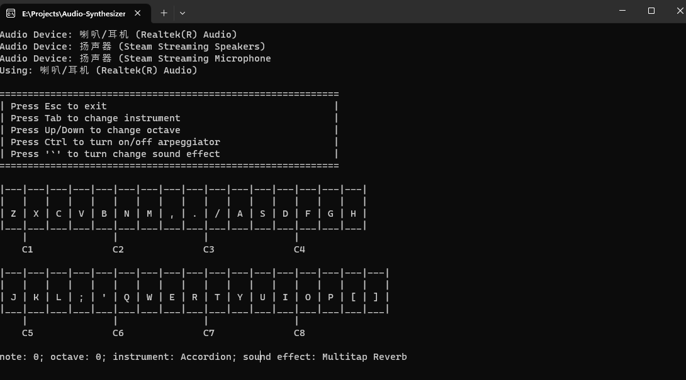

# Audio Synthesizer 

This audio synthesizer is a real-time Windows command-line application written in C++20. 
The key features of this audio synthesizer include polyphony, an arpeggiator, different instruments, different sound effects, and the ability to change octaves.

## Features

### Polyphony

The audio synthesizer supports polyphony, which allows the simultaneous playing of multiple notes. 

### Arpeggiator

It allows the user to play arpeggios automatically in the background.

### Multiple Instruments

The synthesizer supports multiple instruments, providing the user with a variety of sounds to choose from.

### Multiple Sound Effects

The synthesizer includes various sound effects that can be applied to the instruments: flanger, delay and reverb.

### Octave Change

The synthesizer supports octave change functionality, enabling the user to shift the pitch of the played notes up or down by one or more octaves. 

## Usage
Please refer to the picture.

## Compilation
Please load this project in Visual Studio and compile it.

## References
- [Code-It-Yourself sound synthesizer](https://github.com/OneLoneCoder/synth/tree/master)
- [DIY Synthesizer](https://blog.demofox.org/diy-synthesizer/)